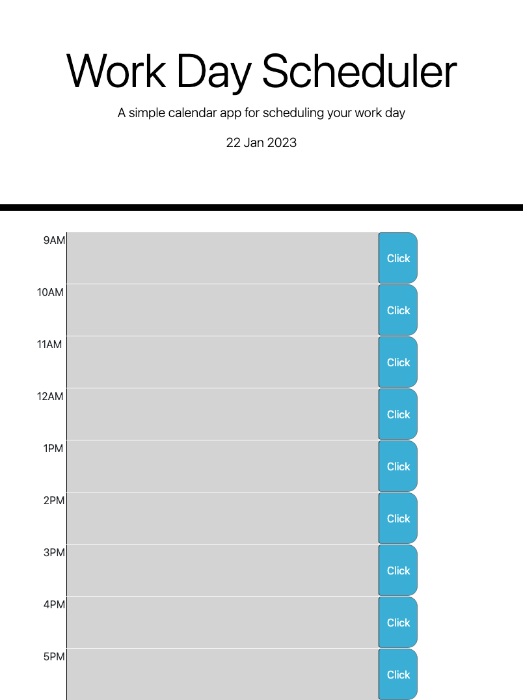

<
<!-- PROJECT LOGO -->
 

  <h1 align="center"> Work Day Scheduler</h1>

  

    This is a calendar application that allows a user to save events for each hour of the day 
     
   

<!-- ABOUT THE PROJECT -->
## About The Project

This app will run in the browser and feature dynamically updated HTML and CSS powered by jQuery.The tim lines are color-coded each time line color based on past(gary), present(red), and future (green).

Here's why:
You can add important events to a daily planner so it  can manage yours time effectively.
 
Use this link[https://asherbeck10.github.io/Work-Day-Scheduler/] to get started.

### Built With
This app  run in the browser, feature dynamically updated HTML with Bootstrap.(DOM),Moment API and CSS powered by JavaScript code.

<!-- USAGE  -->
## Usage
1. Write text into the text area.

2. Click on the orange button to the right to save your input.
3. When answer is clicked, the next question appears.
4. 

<!-- ACKNOWLEDGMENTS -->
## Acknowledgments

* (https://developer.mozilla.org/en-US/)
* (https://www.w3schools.com/js/default.asp)
* (https://getbootstrap.com/docs/4.3/components/input-group/)
* (https://momentjs.com/)

